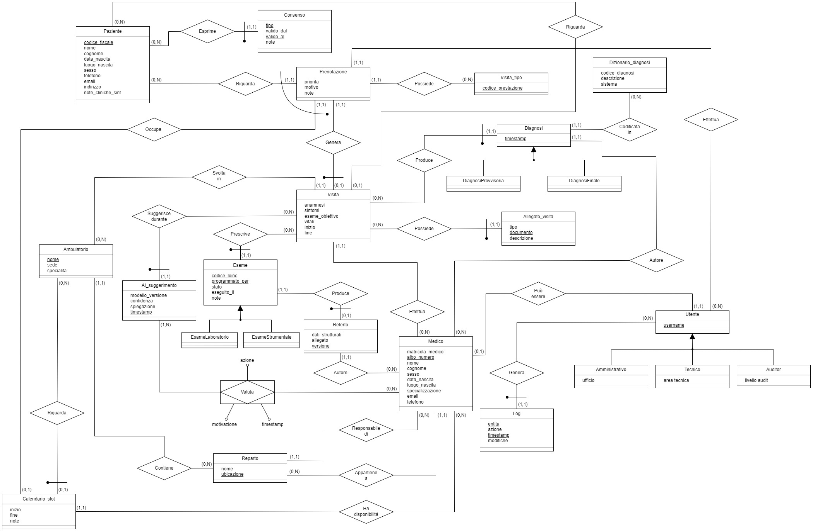
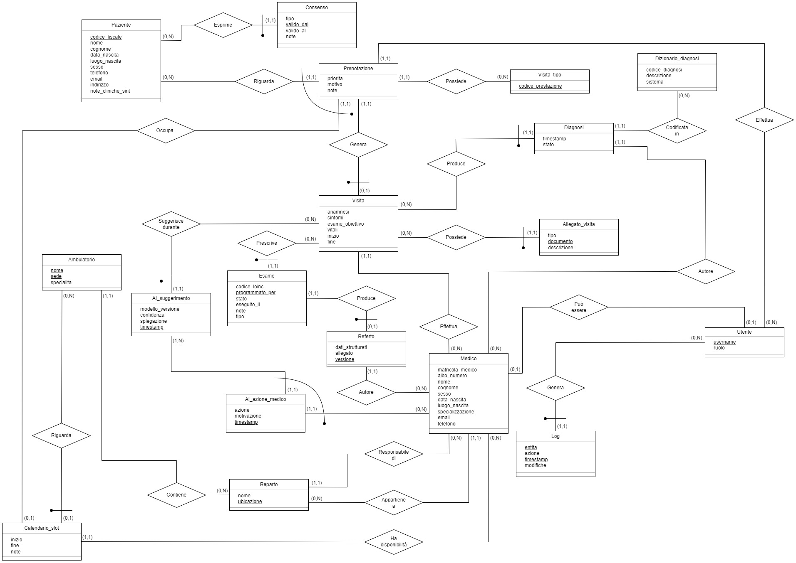

# Hospital Management Database

Hospital database system with AI-assisted diagnostic support, ER modeling, relational design and SQL implementation.

---

## Overview

This project focuses on the conceptual and logical design of a hospital management database system capable of supporting the complete clinical workflow of a patient.

The system manages:

- patients and medical staff
- hospital departments and clinics
- appointments and scheduling
- clinical visits
- diagnostic examinations
- medical reports
- final and provisional diagnoses
- AI-assisted diagnostic suggestions
- audit logging and access control

The project was developed as part of the *Database Systems and Information Systems* course.

---

## Main Features

- Complete hospital workflow modeling
- Conceptual ER design
- Logical restructuring process
- Referential integrity constraints
- AI-assisted diagnosis support
- Audit logging system
- Role-Based Access Control (RBAC)
- Clinical history management
- Standardized diagnostic dictionary
- Scheduling and appointment management

---

## Technologies

- SQL
- Relational Database Design
- ER Modeling
- MySQL / PostgreSQL concepts
- Database normalization
- Integrity constraints

---

## ER Diagram

  

---

## Restructured ER Diagram

  

---

## Relational Schema

  

